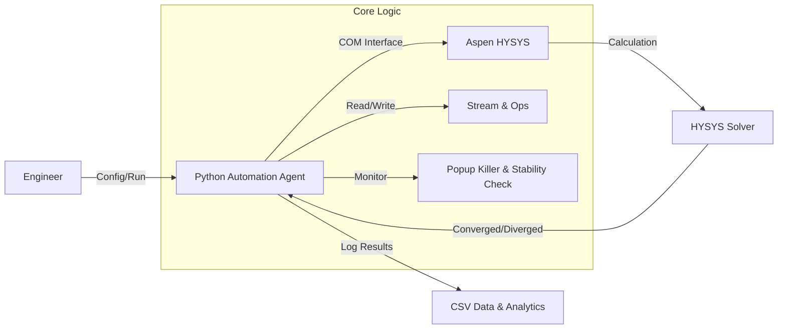
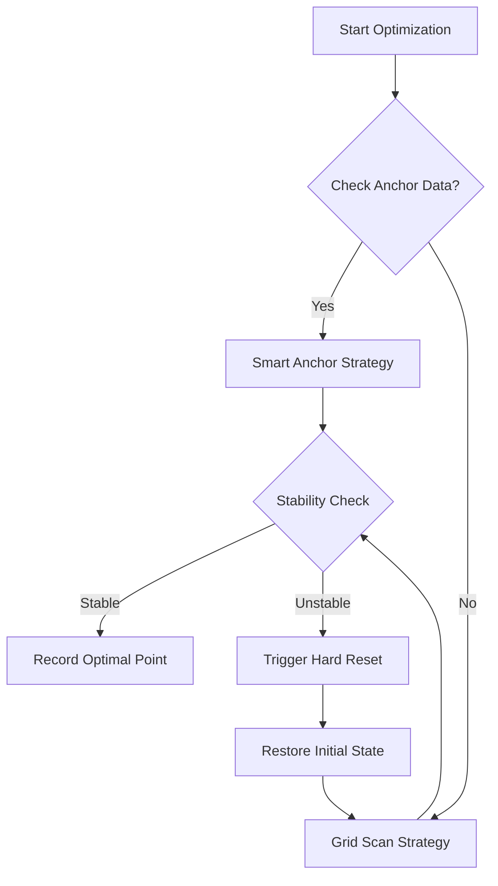

# HYSYS Automation 프로젝트 성과 및 이력 요약

---

## [Slide 1] 프로젝트 개요 (Overview)

### **HYSYS Process Optimization Automation**
*   **목적**: HYSYS 공정 시뮬레이션의 반복 작업을 자동화하여 최적 운전점 도출 및 민감도 분석 수행 (Stream 1 Volume Flow & Stream 10 Mass Flow)
*   **핵심 기술**: Python - HYSYS COM Interface 연동, 예외 처리(Anti-Freeze) 알고리즘, 데이터 기반 최적화 전략
*   **기간/규모**: 초기 연결 테스트부터 다차원(Mass Flow x Volume Flow) 최적화까지 단계적 고도화

### **System Architecture**

---

## [Slide 2] 개발 이력 및 로직 (Development & Workflow)

### **Automation Workflow**

### **Phase 상세**
1.  **Phase 1 (Foundational)**: `win32com` 연결, 단순 태그 매핑 테스트.
2.  **Phase 2 (Robustness)**: **Hard Reset** (강제 초기화) 및 **Popup Killer** (경고창 자동 닫기) 도입으로 무인 운전 실현.
3.  **Phase 3 (Optimization)**: **Grid Scan** (전수 조사) 및 **Smart Anchor** (데이터 기반 탐색) 알고리즘 적용.
4.  **Phase 4 (Expansion)**: Mass Flow (500~1500 kg/h) × Volume Flow (3400~3800 m³/h) **2D Sensitivity Analysis** 수행.

---

## [Slide 3] 거시적 성과: 데이터 (Key Performance Data)

### **1. 획기적인 엔지니어링 효율 향상**
*   **시간 절감**: 1 케이스당 3분 → **0초 (무인 자동화)**
*   **처리량**: 수동 1일 50케이스 한계 → **자동 1일 2,000+ 케이스 수행**

### **2. 운전 최적점(Optimal Point) 도출 결과**
| Mass Flow (kg/h) | Pressure (bar) | Temp (°C) | Power (kW) | Min Approach (°C) |
| :---: | :---: | :---: | :---: | :---: |
| **500** | 3.1 | -116.0 | **694.8** | 2.45 (Stable) |
| **1000** | 5.3 | -106.0 | **1082.3** | 2.40 (Stable) |
| **1500** | 7.4 | -99.0 | **1440.4** | 2.11 (Tight) |

*   **Insight 1**: 유량 3배 증가(500→1500) 시 **전력 소모는 약 2.07배 증가** (695kW → 1440kW).
*   **Insight 2**: 고부하(1500kg/h)에서는 더 높은 압력(7.4bar)과 상대적으로 높은 온도(-99°C)가 요구됨.

### **3. Volume Flow 민감도 (2D Analysis)**
*   **3400 vs 3500 vs 3800 m³/h** 비교 시:
    *   **500 kg/h (Low Load)**: High Volume Flow(3750+)에서 불안정(Tight).
    *   **1500 kg/h (High Load)**: Low Volume Flow(<3500)에서 불안정(Tight).
    *   **결론**: 부하에 따라 운전 가능한 Volume Flow의 **Operational Window가 이동함**을 규명.

---

## [Slide 4] 활용 방안 및 기대 효과 (Applications)

### **[Image Placeholder: Power vs Mass Flow Chart]**
*(여기에 엑셀로 생성한 Power Trend 꺾은선 그래프 삽입 추천)*

### **1. 공정 설계 검증 (Process Verification)**
*   극한 조건(Low/High Load)에서의 공정 안정성 마진(Safety Margin)을 정량적으로 확보.

### **2. 실시간 운전 가이드 (Real-time Advisory)**
*   현재 유량(Mass Flow) 입력 시 → **"권장 운전 압력/온도 및 예상 전력"**을 즉시 제시하는 Lookup Table 구축 완료.

### **3. 교육용 시뮬레이터 (OTS)**
*   다양한 트러블슈팅 시나리오(Solver 발산, Freezing 등)를 자동 생성하여 운전원 교육 자료로 활용.

